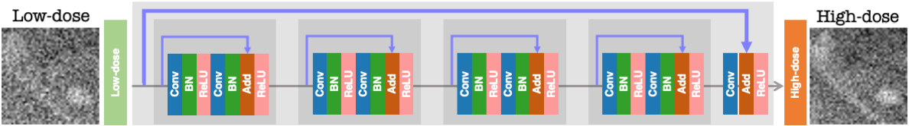

# Assessment of training strategies for convolutional neural network to restore low-dose digital breast tomosynthesis projections

======

This repository contains the training and testing codes for the paper "[Assessment of training strategies for convolutional neural network to restore low-dose digital breast tomosynthesis projections]()", submitted to the [SPIE Medical Imaging 2022](https://spie.org/conferences-and-exhibitions/medical-imaging) conference. We used the OpenVCT from the University of Pennsylvania, available [here](https://sourceforge.net/p/openvct/wiki/Home/). Also, we used a model-based (MB) restoration as a benchmark, also available [here](https://lucasbusp.wixsite.com/lucasborges/image-restoration), which uses the commonly known [BM3D](https://webpages.tuni.fi/foi/GCF-BM3D/). 

## Network architecture:

## Some results:

Soon

## Reference:

Soon

---
Laboratory of Computer Vision ([Lavi](http://iris.sel.eesc.usp.br/lavi/)) 
Department of Electrical and Computer Engineering 
São Carlos School of Engineering, University of São Paulo 
São Carlos - Brazil

AI-based X-ray Imaging System ([AXIS](https://wang-axis.github.io)) 
Department of Biomedical Engineering 
Rensselaer Polytechnic Institute 
Troy - USA 